# Visual walkthrough

This page shows the **sanitized public shortcut template** in Apple Shortcuts on iPhone.

All screenshots are in English and use placeholder values only. No real Govee API key or device ID is shown.

<p align="center">
  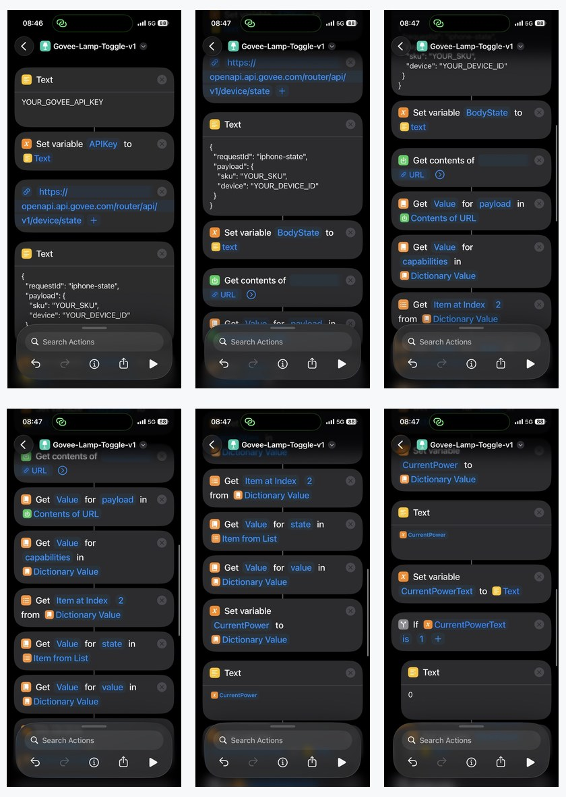
</p>

## Before editing the shortcut

You need three values:

```text
YOUR_GOVEE_API_KEY
YOUR_SKU
YOUR_DEVICE_ID
```

If you do not have them yet, see [Get device info](get-device-info.md).

---

## 1. API key and state request

| API key + state URL | State request body |
|---|---|
| 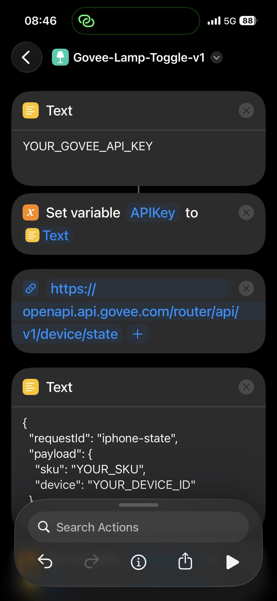 | 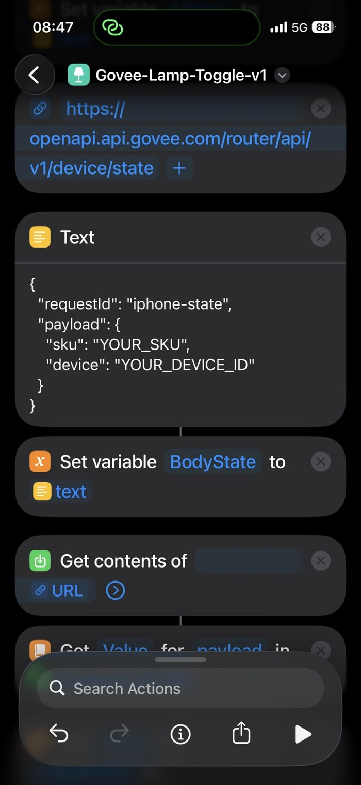 |
| Replace `YOUR_GOVEE_API_KEY`, then keep the `device/state` endpoint unchanged. | Replace `YOUR_SKU` and `YOUR_DEVICE_ID`, then store the JSON as `BodyState`. |

The state call tells the shortcut whether the light is currently on or off.

---

## 2. Read the current `powerSwitch` value

| Find the capability | Read `state.value` |
|---|---|
| 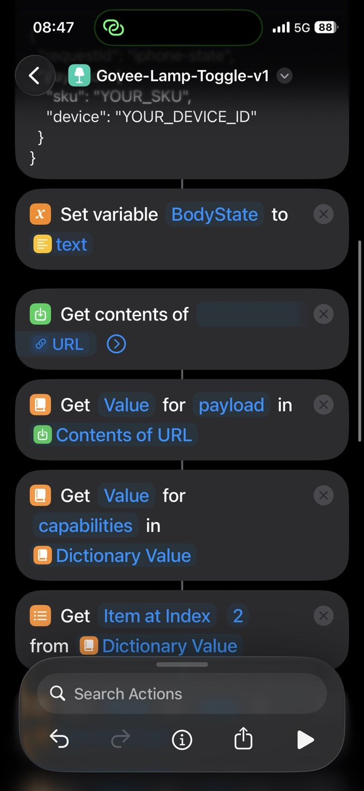 | 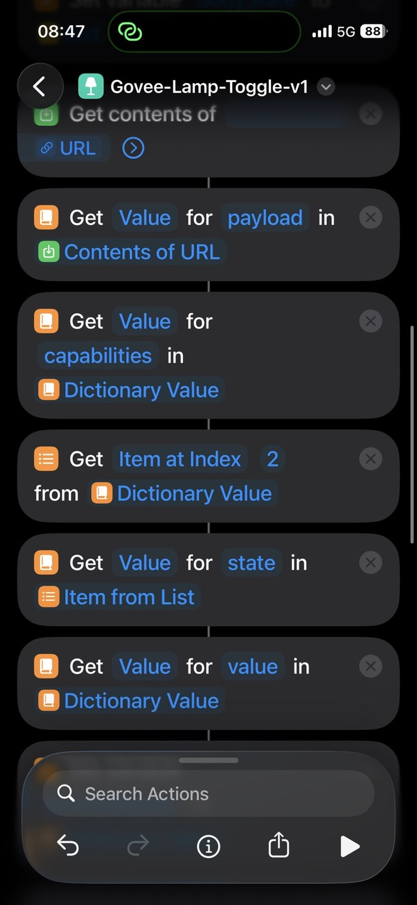 |
| Read `payload`, then `capabilities`, then select the relevant list item. | Read `state`, then `value` from that capability. |

For the tested **H607C**, `powerSwitch` is at index `2`.

> [!NOTE]
> Another Govee model may return capabilities in a different order. If the shortcut does not work, inspect the state response and locate the item whose `instance` is `powerSwitch`.

---

## 3. Save the current state and calculate the opposite value

| Save current power | Compare with `1` |
|---|---|
| 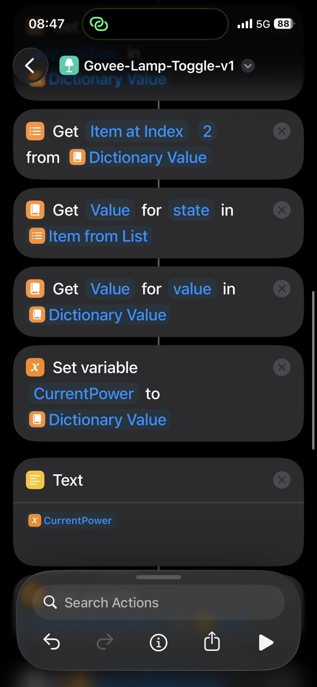 | 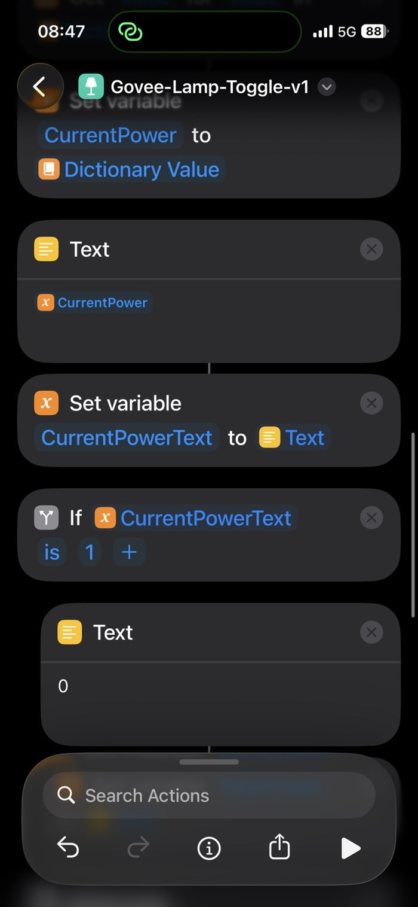 |
| Save the API result as `CurrentPower`. | Convert it to text and test `CurrentPowerText is 1`. |

| Set the new value | Finish the If/Otherwise logic |
|---|---|
| 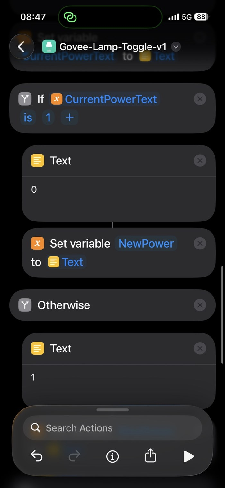 | 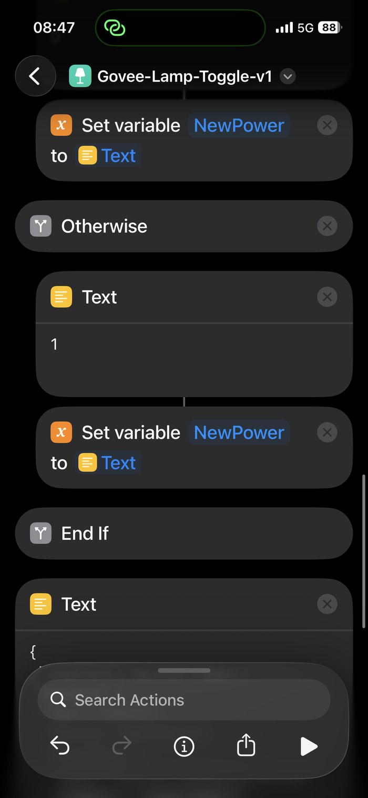 |
| If the current value is `1`, set `NewPower` to `0`. | Otherwise set `NewPower` to `1`, then continue to the control request. |

The toggle logic is simply:

```text
1 → 0
0 → 1
```

---

## 4. Build the control request

| Control body | Insert `NewPower` |
|---|---|
| 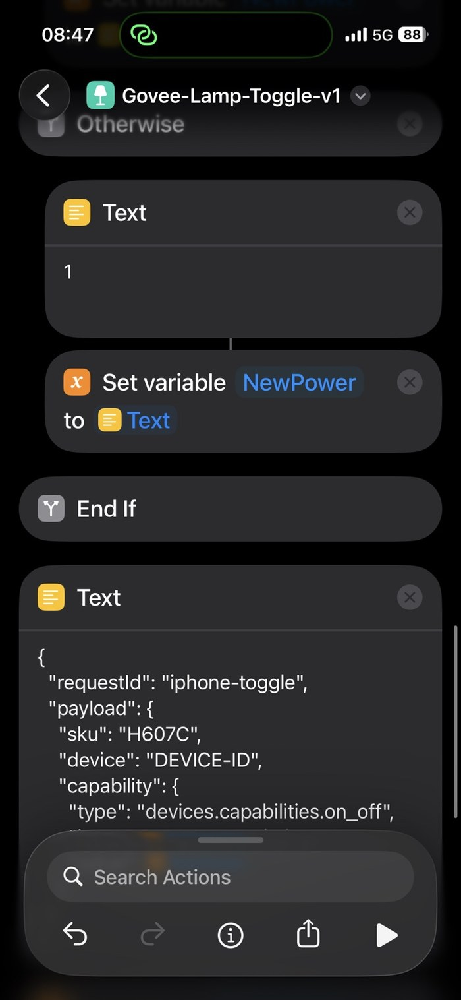 | 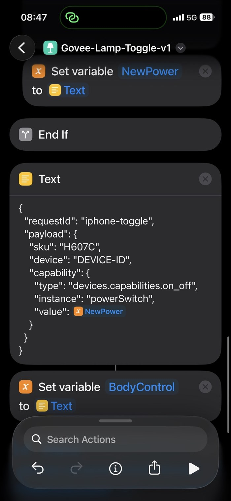 |
| Build the `device/control` JSON body with your SKU and device ID. | Insert the `NewPower` variable as the JSON value and store the result as `BodyControl`. |

The important capability is:

```json
{
  "type": "devices.capabilities.on_off",
  "instance": "powerSwitch",
  "value": NEWPOWER
}
```

`NewPower` must be inserted as a Shortcuts variable, not as quoted text.

---

## 5. Send the control request

<p align="center">
  
</p>

After saving the JSON as `BodyControl`:

1. Add the control endpoint:

```text
https://openapi.api.govee.com/router/api/v1/device/control
```

2. Add **Get Contents of URL**.
3. Use `POST`.
4. Send the same API headers as the state request.
5. Use `BodyControl` as the request body.

This is the final action that sends `NewPower` to the lamp.

---

## 6. Run and test

Run the shortcut once from the Shortcuts app.

If it succeeds, the lamp should immediately switch to the opposite state. Then you can add the shortcut to your Lock Screen, Action Button, widget, Back Tap, Siri, or another Shortcuts trigger.

For the complete written setup, see [Setup guide](setup.md).

For errors, see [Troubleshooting](troubleshooting.md).

## Security reminder

Never publish a screenshot containing:

- a real Govee API key
- a real device ID
- another secret or account identifier

The screenshots in this repository are intentionally sanitized.
